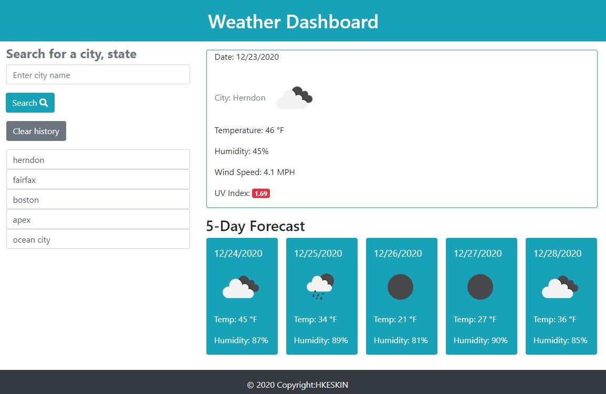

# HKweatherDashboard
Weather-Dashboard is displays the input city current weather and 5 day forecast. Searched cities saved and displayed under search and each history city name click will display the weather and forecast.

The current weather section includes following data
* City name, Date, weather icon
* Temperature
* Humidity
* Wind Speed
* UV index

The 5-days weather forecast dincludes following data
* Date
* Weather Icon image
* Temperature
* Humidity

# Technologies
Bootstrap 4
CSS
Font Awesome -icon
HTML:5
JavaScript
jQuery
Moment.js
Open Weather API (https://openweathermap.org/api)
localStorage` to store any persistent data

## Required URLS

* The URL of the deployed application: https://kinziva.github.io/HKweatherDashboard/
* The URL of the GitHub repository: https://github.com/kinziva/HKweatherDashboard
